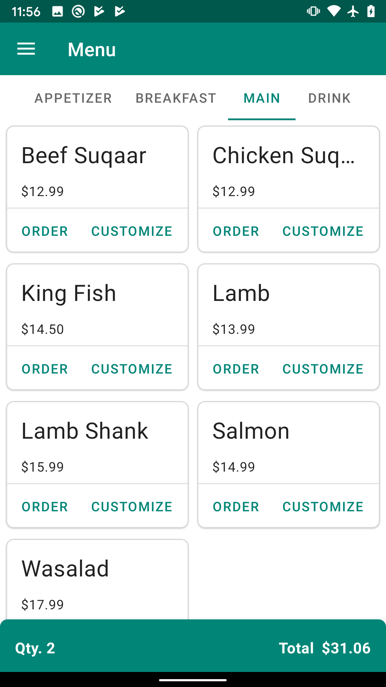
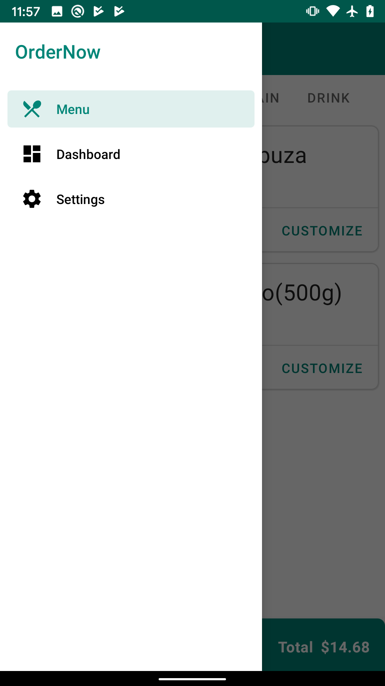
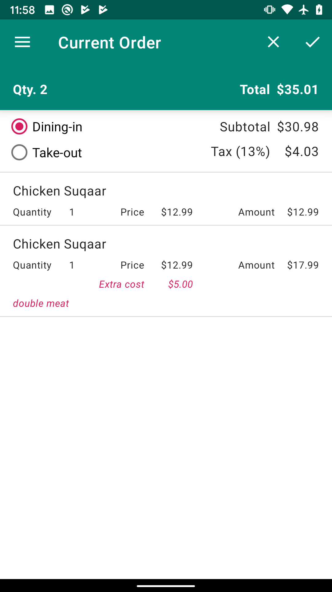
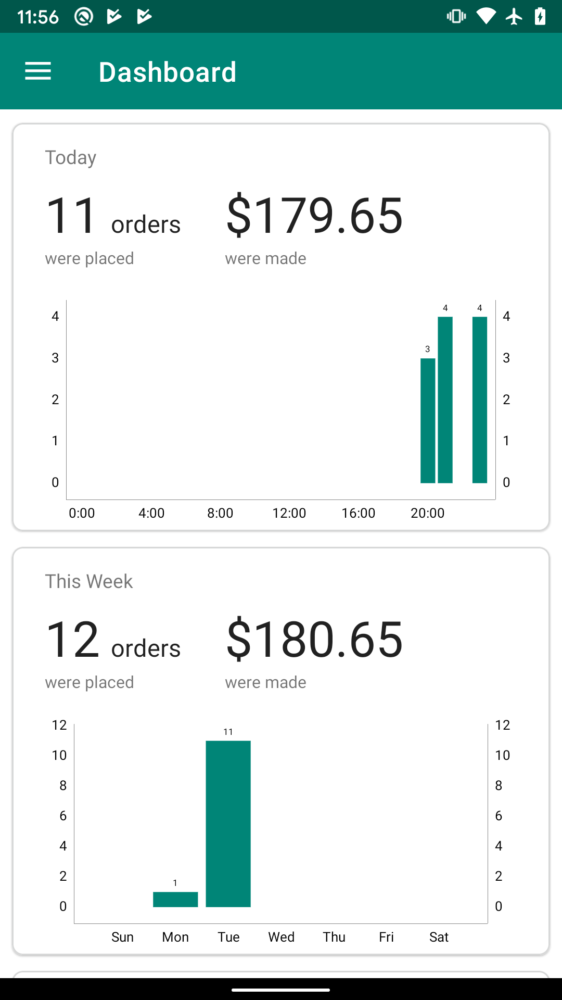

# OrderNow

A simple point of sale system that I made for a restaurant owned by a friend of mine's family (Check out their awesome restaurant: [Asli Dinning](https://www.google.com/maps/place/Asli+Dining/@45.3653267,-75.6617247,17z/data=!3m1!4b1!4m5!3m4!1s0x4cce08bdb40084c9:0x622e1a63edcb4ccf!8m2!3d45.365323!4d-75.659536)).

This app illustrates some Android development practices with [Android Jetpack](https://developer.android.com/jetpack/). 
Some of the libraries that I used worth to mentioning: 
* [Data Binding](https://developer.android.com/topic/libraries/data-binding/)
* [Kotlin KTX](https://developer.android.com/kotlin/ktx)
* [Lifecycles](https://developer.android.com/topic/libraries/architecture/lifecycle)
* [LiveData](https://developer.android.com/topic/libraries/architecture/livedata)
* [Navigation](https://developer.android.com/guide/navigation)
* [Preferences](https://developer.android.com/guide/topics/ui/settings)
* [Room](https://developer.android.com/topic/libraries/architecture/room)
* [ViewModel](https://developer.android.com/topic/libraries/architecture/viewmodel)
* [WorkManager](https://developer.android.com/topic/libraries/architecture/workmanager)

For charting parts, I used [MPAndroidChart](https://github.com/PhilJay/MPAndroidChart).

This app is almost completed, however a major feature is yet to be added. That is the connectivity to POS printers, which most likely will be located
in the kitchen so that chefs can read printed orders. I think I will start off working with 
[Epson POS printers](https://epson.com/For-Work/Printers/POS/c/w150) and using their 
[ePOS-Print API](https://c4b.epson-biz.com/modules/community/index.php?content_id=3).

Screenshots
-----------

   
